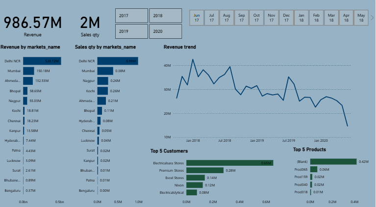

# 📊 AtliQ Hardware – Sales Insights Dashboard (Power BI)

## 🧠 Project Overview

AtliQ Hardware, a growing B2B hardware supplier, is struggling with Excel-based reporting that lacks interactivity, speed, and clarity. This project builds a fully dynamic, stakeholder-ready Power BI dashboard that provides actionable sales insights across customers, markets, products, and time.

---

## 🎯 Objectives

- Replace Excel reporting with dynamic dashboards
- Identify top-performing markets, customers, and products
- Track sales performance over time
- Enable slicing by year and month
- Provide insights for the sales leadership team to improve decision-making

---

## 🗂️ Dataset Summary

The dataset consists of 4 tables extracted from a SQL database:

- **Transactions** — Includes order date, product code, customer code, quantity, sales amount, currency
- **Customers** — Customer-level metadata
- **Products** — Product code, name, and category
- **Markets** — Market code and location details
- **Date** — Date dimension table for slicing by month/year

---
## 🛠 Tools & Technologies

- **Power BI**: Data visualization
- **SQL**: Data extraction and transformation
- **DAX**: Custom calculations in Power BI
- **Excel**: Intermediate data preprocessing
- **MS SQL Server**: Database
## 🔢 DAX Measures Used

---

```DAX
-- Total Revenue
Total Revenue = SUM(Transactions[Revenue])

-- Total Sales Quantity
Total Sales Qty = SUM(Transactions[Qty])

-- Revenue Last Year (Optional enhancement)
Revenue LY = CALCULATE([Total Revenue], SAMEPERIODLASTYEAR('Date'[Date]))

-- Selected Year (for display in visuals)
Selected Year = SELECTEDVALUE('Date'[Year])
```
---

## 🔍 Key Insights

- 💰 **Revenue**: ₹986.57M
- 📦 **Total Sales Quantity**: 2M Units
- 🌍 **Top Market**: Delhi NCR (₹520.72M Revenue)
- 🛍 **Top Customer**: Electricalara Stores (₹0.65M Revenue)
- 🧃 **Top Product**: Product65 (₹0.42M Revenue)
- ⏳ **Revenue Trend**: Consistent growth with noticeable seasonality from 2017–2020
- 📅 **Time Filters**: Slicer by year and month for flexible reporting

---
## Dashboard Preview


